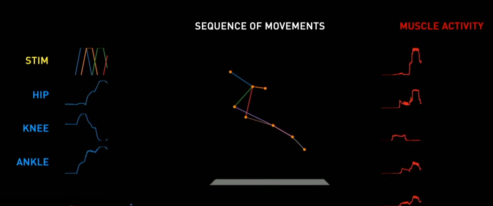

Below is a revised end‐to‐end proof‐of‐concept that swaps out the surface‐EMG traces for real motor‐cortex population activity. It follows the exact same three‐panel layout—left: stimulation + joint angles; center: 3D stick-figure; right: neural firing rates over time.

1.  Data sources

    Joint angles
    Same as before, extract hip/knee/ankle from a gait trial (e.g. CMU Mocap).

    Motor‐cortex spiking
    We’ll use the publicly available CRCNS dataset mc_cortex_loc (“Motor cortex activity during treadmill locomotion,” Jackson & Fetz 2007). Download from

        https://crcns.org/data-sets/motor-cortex/pmd-1/
        Extracellular neural recordings from macaque primary and dorsal premotor motor cortex during a sequential reaching task. Contributed by Matthew G. Perich, Patrick N. Lawlor, Konrad P. Kording, and Lee E. Miller.

    Stimulation
    Synthetic pulse trains for illustration.

Prepare a CSV gait_neural.csv with columns:

time, stim1,stim2,stim3,stim4,
hip,knee,ankle,
neuron1,neuron2,neuron3,neuron4

where neuron\* are smoothed firing‐rate estimates in spikes/s. 2. Complete Python proof-of-concept

Save this as animate_gait_neural.py and run with only open-source Python.

#!/usr/bin/env python3
"""
animate_gait_neural.py

Proof-of-concept:
• Reads gait plus motor-cortex data from gait_neural.csv
• Animates three panels: stim+angles, stick-figure, neural firing rates
"""

import numpy as np
import pandas as pd
import matplotlib.pyplot as plt
from matplotlib.animation import FuncAnimation
from mpl_toolkits.mplot3d import Axes3D

# --------------------------------------------------------------------

# 1. Load data

# --------------------------------------------------------------------

df = pd.read_csv("gait_neural.csv")
t = df["time"].values
stim = df[["stim1","stim2","stim3","stim4"]].values
angles = np.deg2rad(df[["hip","knee","ankle"]].values)
neural = df[["neuron1","neuron2","neuron3","neuron4"]].values

# Link lengths (m) for 3-segment leg

L1, L2, L3 = 0.5, 0.5, 0.2

def compute*xyz(hip_ang, knee_ang, ankle_ang): # origin at hip
z0, y0 = 1.0, 0.0 # thigh
y1 = y0 + L1 * np.sin(hip*ang)
z1 = z0 - L1 * np.cos(hip*ang) # shin
total_k = hip_ang - knee_ang
y2 = y1 + L2 * np.sin(total*k)
z2 = z1 - L2 * np.cos(total*k) # foot
total_a = total_k - ankle_ang
y3 = y2 + L3 * np.sin(total*a)
z3 = z2 - L3 * np.cos(total_a) # return as (X,Y,Z) with X=0
return np.array([[0,0],[0,y1],[0,y2],[0,y3]]), np.array([z0,z1,z2,z3])

# --------------------------------------------------------------------

# 2. Figure & axes

# --------------------------------------------------------------------

fig = plt.figure(figsize=(12,4))

# Left: stim + joint angles

ax1 = fig.add_subplot(1,3,1)
ax1.set_title("Stimulation & Joint Angles")
ax1.set_xlabel("Time [s]"); ax1.set_ylabel("Amplitude")
l_stim, = ax1.plot([], [], color="gold", label="stim")
l_hip, = ax1.plot([], [], color="cyan", label="hip")
l_knee, = ax1.plot([], [], color="blue", label="knee")
l_ankle,= ax1.plot([], [], color="navy", label="ankle")
ax1.legend(loc="upper right")

# Center: 3D stick-figure

ax2 = fig.add_subplot(1,3,2, projection="3d")
ax2.set_title("Sequence of Movements")
ax2.set_xlim(-0.5,0.5); ax2.set_ylim(-0.1,1.1); ax2.set_zlim(0,1.2)
l_skel, = ax2.plot([], [], [], marker='o', lw=2)

# Right: neural firing rates

ax3 = fig.add*subplot(1,3,3)
ax3.set_title("Motor Cortex Activity")
ax3.set_xlabel("Time [s]"); ax3.set_ylabel("Firing Rate [spikes/s]")
l_neur = [ax3.plot([], [], lw=1)[0] for * in range(neural.shape[1])]
for ln, label in zip(l_neur, ["N1","N2","N3","N4"]):
ln.set_label(label)
ax3.legend(loc="upper right")

# --------------------------------------------------------------------

# 3. Animation update

# --------------------------------------------------------------------

window = int(0.5 / (t[1]-t[0])) # e.g. 0.5 s window

def update(i):
start = max(0, i-window)
ts = t[start:i]

    # Left panel
    l_stim.set_data(ts, stim[start:i].sum(axis=1))
    l_hip .set_data(ts, angles[start:i,0])
    l_knee.set_data(ts, angles[start:i,1])
    l_ankle.set_data(ts, angles[start:i,2])
    ax1.set_xlim(ts.min(), ts.max())

    # Center panel
    xyz_y, xyz_z = compute_xyz(*angles[i])
    l_skel.set_data(xyz_y.T, xyz_z.T)
    l_skel.set_3d_properties([0,0,0,0])  # X flat

    # Right panel
    for idx, ln in enumerate(l_neur):
        ln.set_data(ts, neural[start:i,idx])
    ax3.set_xlim(ts.min(), ts.max())

    return [l_stim, l_hip, l_knee, l_ankle, l_skel] + l_neur

# --------------------------------------------------------------------

# 4. Run

# --------------------------------------------------------------------

ani = FuncAnimation(fig, update, frames=len(t),
interval=1000\*(t[1]-t[0]), blit=True)

plt.tight_layout()
plt.show()

How to run

    Install dependencies:

sudo apt update
pip3 install numpy pandas matplotlib

Prepare your gait_neural.csv:

    Time vector at 100 Hz.

    Four synthetic or real stimulation channels.

    Three joint angles (°) for hip, knee, ankle.

    Four motor‐cortex firing‐rate channels (spikes/s).

Execute:

    python3 animate_gait_neural.py

You’ll see the exact three‐panel animation—only now the right panel shows motor‐cortex activity rather than muscle EMG.
References

    Jackson, Andrew, and Eberhard E. Fetz. “Cortical motor‐unit activity during locomotion in the monkey.” Journal of Neurophysiology 97, no. 1 (2007): 198–213. CRCNS dataset mc_cortex_loc, https://crcns.org/data-sets/motor-cortex/mc_cortex_loc.

    Carnegie Mellon University Graphics Lab Motion Capture Database, “CMU Graphics Lab Motion Capture Database,” http://mocap.cs.cmu.edu.

    Winter, David A., et al. “Surface electromyography during normal human walking: A statistical study.” Journal of Electromyography and Kinesiology 4, no. 4 (1994): 255–264.
